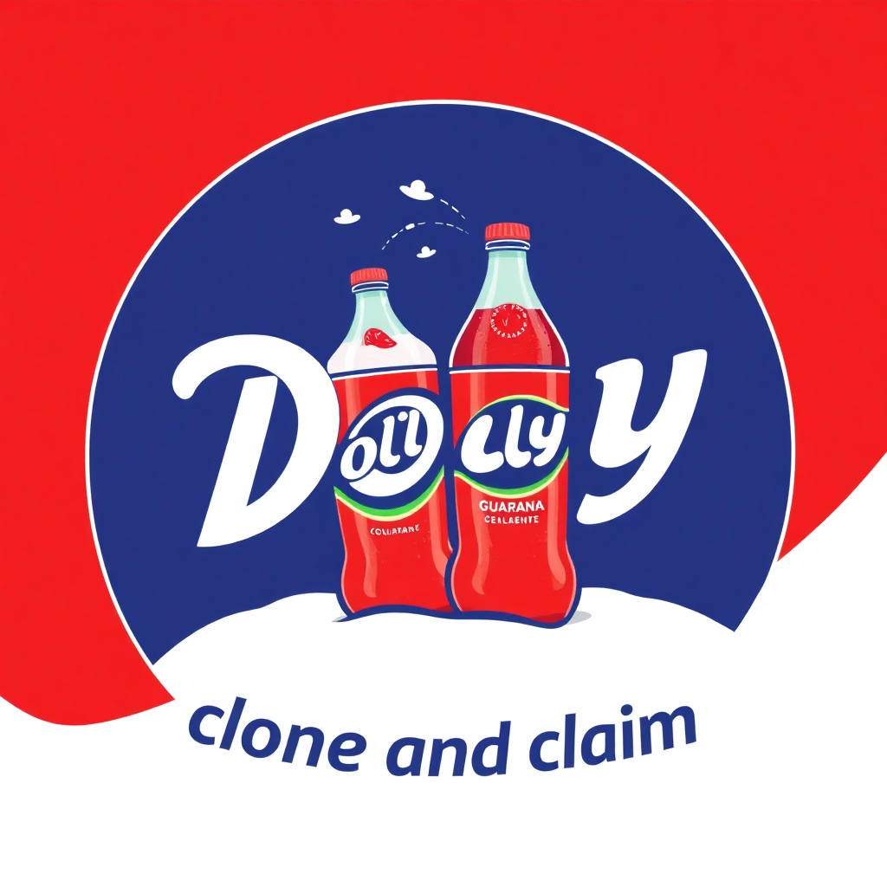

# Clone and Claim

A script designed for interviews to let candidates quickly copy a project template for code challenges.
Instead of starting from scratch, candidates can clone the template, repoint it to their own repository, and begin coding immediately. 

